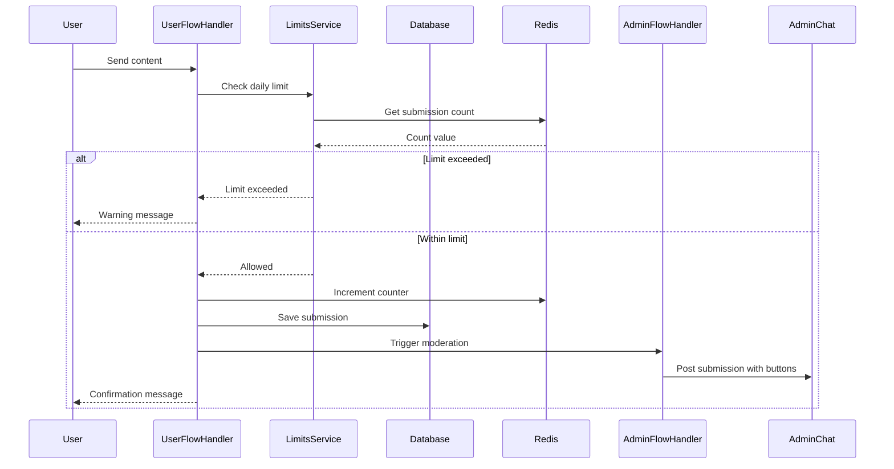
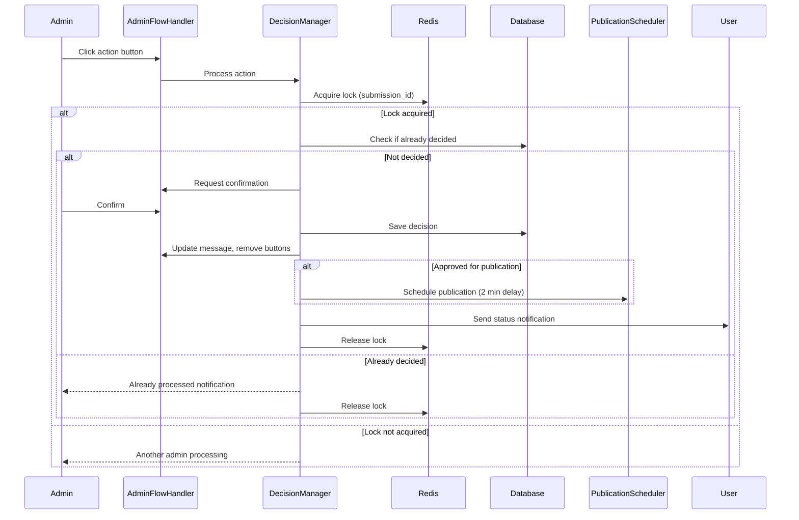
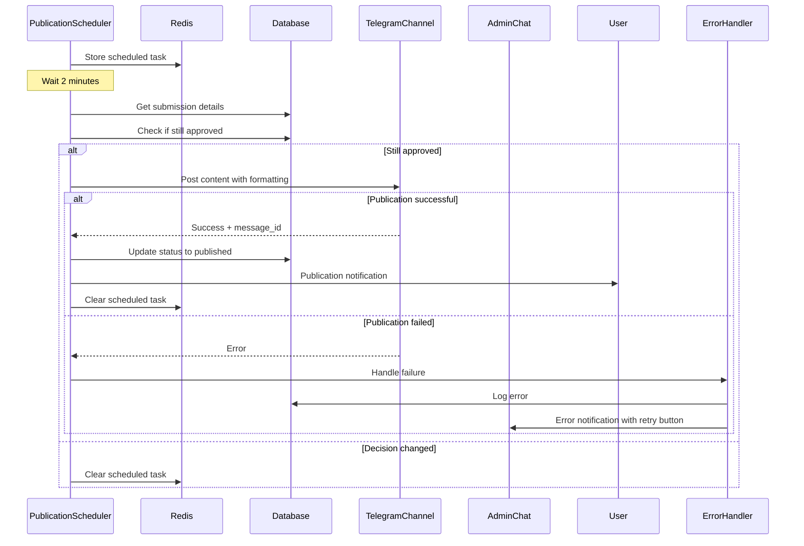
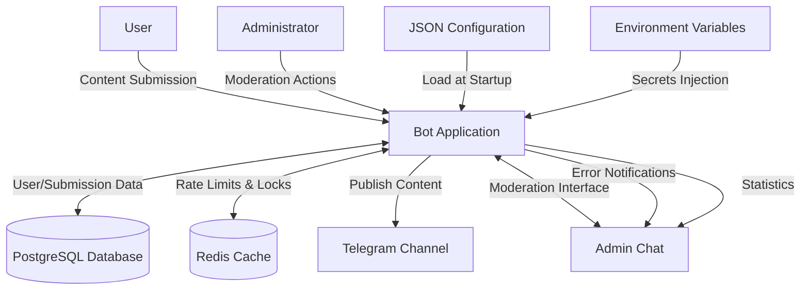
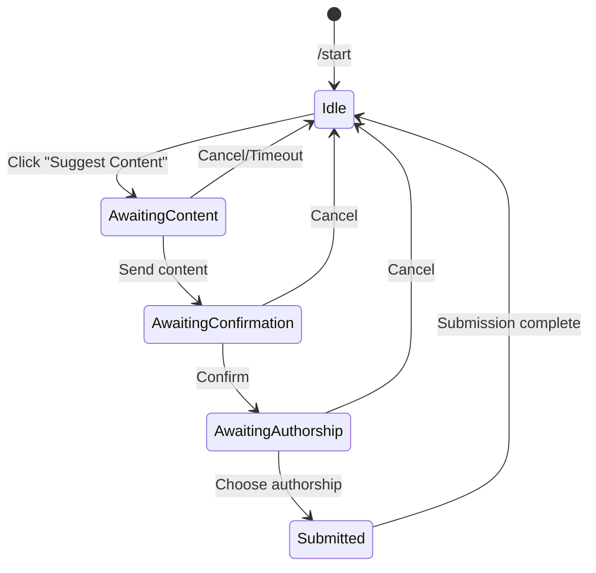
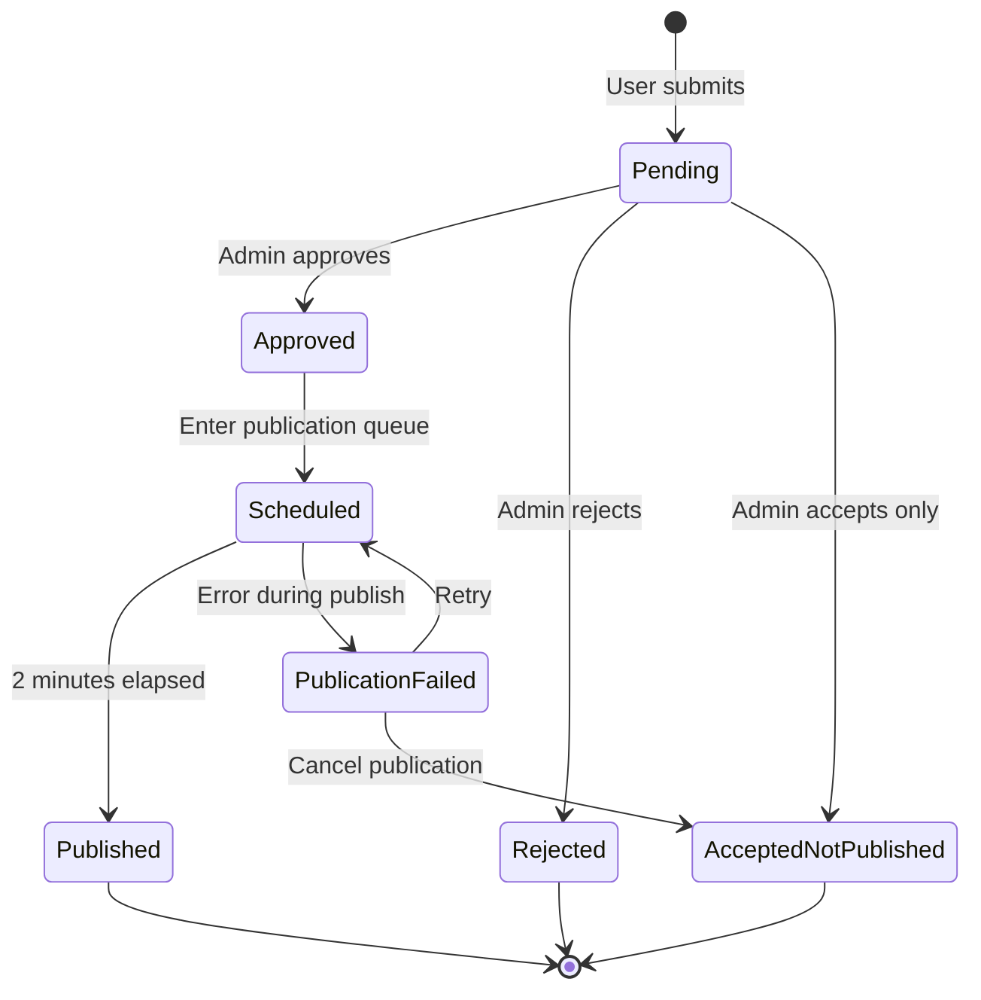

# Telegram Bot for UGC Collection and Moderation - Design Document

## 1. System Overview

### 1.1 Purpose

The system is a Telegram bot designed to collect User-Generated Content (UGC) for a single Telegram channel with mandatory moderation through an admin chat. The bot centralizes content submission processing without personal messages to administrators and maintains statistics with minimal action logging.

### 1.2 Core Capabilities

- User content submission with optional authorship attribution
- Mandatory moderation workflow through dedicated admin chat
- Automated content publication with configurable delay
- User rate limiting and spam prevention
- Admin decision tracking and statistics
- User blocking and note management
- Comprehensive error handling and recovery

### 1.3 Target Environment

- **Platform**: Telegram channel
- **Theme**: News and community content
- **Audience Scale**: Up to 5,000 users
- **Interface Language**: Russian
- **Architecture Pattern**: Monolithic single-service application
- **Interaction Model**: Inline buttons only (no text commands except /start)
- **Scope**: One bot instance serves one channel

## 2. Technology Stack

### 2.1 Application Layer

- **Language**: Python 3.11+
- **Bot Framework**: aiogram 3.x
- **Async Runtime**: asyncio-based event loop

### 2.2 Data Layer

- **Primary Database**: PostgreSQL
- **ORM**: SQLAlchemy 2.0 (async mode)
- **Database Driver**: asyncpg
- **Cache/State Store**: Redis

### 2.3 Infrastructure Layer

- **Containerization**: Docker
- **Orchestration**: docker-compose
- **Service Management**: systemd (on VPS)
- **Version Control**: GitHub

### 2.4 Redis Usage Patterns

- Rate limiting enforcement (2 submissions per calendar day)
- Admin action synchronization to prevent race conditions
- Temporary user state storage during flows
- Session data for multi-step interactions

## 3. Roles and Access Control

### 3.1 User Role

**Permissions:**
- Submit content proposals to the bot
- Optionally specify authorship attribution
- Receive status notifications about submissions

**Restrictions:**
- Maximum 2 submissions per calendar day
- Subject to moderation approval
- Can be blocked by administrators

### 3.2 Administrator Role

**Permissions:**
- Review all submitted content
- Approve, reject, or accept without publishing
- Block/unblock users
- Add/edit user notes
- View statistics

**Access Model:**
- Administrator list defined in JSON configuration
- All administrators have equal privileges (flat hierarchy)
- All moderation actions performed in unified admin chat

**Authorization:**
- User ID-based identification
- No role delegation or hierarchy levels

## 4. User Interaction Flow

### 4.1 Initial Contact (/start command)

When a user initiates conversation with the bot, the system presents:

- Bot purpose description
- Content submission rules
- Daily submission limits explanation
- Moderation process notice
- Call-to-action button: "Предложить контент" (Suggest Content)

**State Management:**
- User record created or updated in database
- Username synchronized
- Last interaction timestamp recorded

### 4.2 Content Submission Flow

**Step 1: Content Input**
- User clicks "Предложить контент" button
- Bot prompts for content submission
- User sends single message with text and/or media
- Supported media types: photo, video, document, audio

**Step 2: Submission Confirmation**
- Bot displays preview of submitted content
- User confirms submission with inline button

**Step 3: Authorship Attribution**
- Bot asks whether to include user attribution
- User chooses via inline buttons:
  - Include username
  - Submit anonymously

**Step 4: Rate Limit Validation**
- System checks daily submission count against limit
- If limit not exceeded: submission forwarded to moderation
- If limit exceeded: rejection notification sent

**Step 5: Acknowledgment**
- Confirmation message sent to user
- Notification that content awaits moderation

### 4.3 Status Notifications

Users receive notifications when:
- Submission accepted and published
- Submission accepted but not published
- Submission rejected
- User account blocked/unblocked

### 4.4 Rate Limiting Behavior

**Daily Limit**: 2 submissions per calendar day (timezone-aware)

**Enforcement:**
- 1st and 2nd submission: normal processing
- 3rd attempt: rejection with warning message
- Further attempts: warning reminder without processing

**Reset Logic:**
- Counter resets at midnight in configured timezone
- Redis-based atomic counter increment

## 5. Admin Moderation Flow

### 5.1 Submission Presentation

Each user submission creates a single message in the admin chat containing:
- User information (ID, username, submission count)
- Submitted content (text + media)
- Author attribution preference
- Existing user notes (if any)
- Submission timestamp

### 5.2 Admin Action Buttons

Inline keyboard attached to each submission message:

**Primary Actions:**
- **"Принять и опубликовать"** (Approve and Publish) - green indicator
- **"Принять"** (Approve Only) - yellow indicator
- **"Отклонить"** (Reject) - red indicator

**User Management Actions:**
- **"Заблокировать пользователя"** / **"Разблокировать"** (Block/Unblock User)
- **"Добавить заметку"** / **"Изменить заметку"** (Add/Edit Note)

### 5.3 Decision Confirmation Flow

**Step 1: Action Selection**
- Admin clicks action button
- Bot requests confirmation with inline keyboard

**Step 2: Confirmation**
- Admin confirms or cancels action
- Only first confirmed action is executed (prevents duplicate decisions)

**Step 3: Finalization**
- Submission message edited to show decision
- All action buttons removed
- Decision footer added with format:
  ```
  Решение: [Действие]
  Администратор: @[username]
  Время: [timestamp]
  ```

### 5.4 Race Condition Prevention

**Locking Mechanism:**
- Redis-based distributed lock per submission ID
- Lock acquired when admin clicks action button
- Lock released after decision finalized or timeout
- Concurrent action attempts receive "already processing" notification

### 5.5 Note Management

**Note Characteristics:**
- One note per user
- Free-form text content
- Editable by any administrator
- Visible in all future submissions from user
- Persisted in database

**Note Workflow:**
- Admin clicks "Добавить заметку" button
- Bot prompts for note text
- Admin sends text message
- Note saved and displayed in current submission message

## 6. Content Publication

### 6.1 Publication Trigger

Publication initiated when admin selects "Принять и опубликовать" action.

### 6.2 Publication Delay

**Fixed Delay**: 2 minutes from approval moment

**Purpose:**
- Allow admin to cancel if needed
- Prevent immediate reaction to moderation decisions
- Provide buffer for error correction

**Implementation:**
- Asynchronous task scheduling
- Cancellable task reference stored in Redis

### 6.3 Publication Format

**Message Structure:**

```
[Media Content]

[Original Text Content]

Автор: @[username]  ← (only if authorship specified)

[Footer]  ← (if enabled in config)
[Hashtags]  ← (if enabled in config)
```

**Media Handling:**
- Media forwarded with original quality
- Captions preserved and formatted
- Media groups handled as single unit

### 6.4 Authorship Attribution

**If User Chose Attribution:**
- Line added: "Автор: @[username]"
- Positioned after main content, before footer

**If Anonymous Submission:**
- No attribution line added

### 6.5 Footer and Hashtags

**Configuration-Driven:**
- Disabled by default
- Can be enabled via JSON configuration
- Content templates defined in configuration
- Applied consistently to all publications

## 7. User Management Features

### 7.1 User Blocking

**Blocking Behavior:**
- Does NOT prevent content submission
- Serves as visual indicator for administrators
- Blocked status shown in submission messages
- Can be toggled by any administrator

**Purpose:**
- Flag problematic users
- Provide context for moderation decisions
- Track user behavior patterns

**Database Representation:**
- Boolean flag in user record
- Block/unblock actions logged with timestamp and admin ID

### 7.2 User Notes

**Storage:**
- Single text field per user in database
- Unlimited length
- Supports multi-line text

**Display:**
- Shown in admin chat for every submission from user
- Formatted as quoted text block
- Updated in real-time when modified

**Use Cases:**
- Track user warnings
- Document previous issues
- Note special arrangements or context

## 8. Data Storage Schema

### 8.1 User Data

**Stored Attributes:**
- user_id (Telegram user ID, primary key)
- username (synchronized on each interaction)
- first_name and last_name
- is_blocked (boolean flag)
- admin_note (text field)
- total_submissions_count
- registration_timestamp
- last_interaction_timestamp

**Privacy Considerations:**
- No message content stored permanently
- Media files not persisted on server
- Only metadata and counters retained

### 8.2 Submission Data

**Stored Attributes:**
- submission_id (UUID, primary key)
- user_id (foreign key)
- submission_timestamp
- status (pending/approved/rejected/published)
- moderator_id (admin who made decision)
- decision_timestamp
- show_authorship (boolean)
- message_id_in_admin_chat
- message_id_in_channel (if published)

**Retention:**
- Submissions stored for statistical purposes
- Message content referenced by Telegram message IDs
- No full content duplication

### 8.3 Admin Action Log

**Logged Events:**
- Decision type (approve/reject/block/note)
- Admin user ID
- Target user ID or submission ID
- Action timestamp
- Additional context (if applicable)

**Purpose:**
- Audit trail
- Statistics generation
- Behavior analysis

### 8.4 Media Handling

**Approach:**
- Media files NOT stored on application server
- Telegram file_id used for reference
- Media forwarded directly between chats
- No local file system usage

## 9. Statistics System

### 9.1 Access Method

Statistics triggered via inline button in admin chat, accessible through:
- Persistent menu message in admin chat
- Bot command in admin chat
- Inline keyboard in admin panel

### 9.2 Time Period Selection

**Default View:**
- Current calendar month statistics

**Custom Period:**
- Month selector (1-12)
- Year selector (configurable range)
- Generated on-demand via inline keyboard navigation

### 9.3 Statistics Metrics

**Submission Metrics:**
- Total submissions received
- Submissions approved
- Submissions published
- Submissions rejected

**User Metrics:**
- Unique users who submitted
- New users in period
- Blocked users count

**Admin Performance:**
- Decisions per administrator
- Average decision time
- Actions breakdown by type

**Rate Metrics:**
- Approval rate (approved/total)
- Publication rate (published/approved)
- Rejection rate (rejected/total)

### 9.4 Presentation Format

**Message Structure:**
- Period header (Month Year)
- Metrics organized in sections
- Visual separators between sections
- Per-admin breakdown table
- Navigation buttons for period selection

**Example Layout:**

```
📊 Статистика за [Месяц Год]

📥 Предложено: [число]
✅ Принято: [число]
📢 Опубликовано: [число]
❌ Отклонено: [число]

👥 Уникальных пользователей: [число]

📋 По администраторам:
@admin1: [число] решений
@admin2: [число] решений

[Кнопки навигации по периодам]
```

## 10. Error Handling and Recovery

### 10.1 Bot Restart Scenarios

**On Application Restart:**
- Active submissions retain state via database persistence
- Pending publications rescheduled from database
- User states restored from Redis or reinitialized
- Admin chat receives notification: "Бот перезапущен, все активные задачи восстановлены"

**State Recovery:**
- Database queried for pending submissions
- Publication scheduler rehydrated
- Active user sessions cleared (users prompted to restart flow)

### 10.2 Admin Chat Unavailable

**Detection:**
- Bot unable to send message to admin chat
- API error indicating chat not found or bot removed

**Response:**
- Error logged to database
- If configured, notification sent to backup error chat
- Submissions queued in database with "pending_admin_chat" status
- Periodic retry attempts (exponential backoff)
- When chat restored, queued submissions sent

### 10.3 Publication Failure

**Failure Scenarios:**
- Channel not accessible
- Bot lacks posting permissions
- Media file no longer available
- Network timeout

**Handling:**
- Error details logged to database
- Admin chat receives detailed error notification
- Submission marked as "publication_failed"
- Retry button provided in admin notification
- Manual intervention option (copy/paste content)

**Notification Format:**
```
⚠️ Ошибка публикации

Предложка ID: [id]
Пользователь: @[username]
Ошибка: [error message]

[Кнопка "Повторить"] [Кнопка "Отменить"]
```

### 10.4 Database Connection Issues

**Detection:**
- Connection timeout
- Query execution failure
- Connection pool exhausted

**Response:**
- Automatic reconnection attempts (3 retries)
- If persistent: bot enters read-only mode
- User submissions receive "temporarily unavailable" message
- Admin chat notified of database issues
- Health check endpoint returns unhealthy status

### 10.5 Redis Connection Issues

**Impact:**
- Rate limiting unavailable
- State persistence affected
- Lock mechanism disabled

**Fallback Behavior:**
- Rate limits enforced via database queries (slower but functional)
- User states stored in-memory (lost on restart)
- Admin actions serialized (slower response)
- Admin chat notified of degraded performance

### 10.6 Notification Strategy

**Admin Notifications Sent For:**
- Bot restarts and recoveries
- Database or Redis connection issues
- Publication failures
- Configuration reload events
- Critical unhandled exceptions

**Notification Channel Priority:**
1. Primary admin chat
2. Configured error/log chat (if different)
3. Direct message to configured primary admin (fallback)

## 11. Configuration Management

### 11.1 Configuration Structure

Configuration stored in one or more JSON files with logical separation:

**Recommended File Organization:**
- `config.json` - main configuration
- `messages.json` - all user-facing texts
- `secrets.json` - sensitive credentials (excluded from version control)

### 11.2 Configuration Categories

#### 11.2.1 Text Content Configuration

**User Messages:**
- Welcome message (/start command)
- Rules and guidelines text
- Submission prompts and confirmations
- Status notification templates
- Error messages
- Limit exceeded warnings

**Admin Messages:**
- Submission header template
- Decision confirmation prompts
- Statistics report template
- Error notification templates

**Button Labels:**
- All inline button texts
- Navigation button labels
- Confirmation/cancellation button texts

**Template Variables:**
- Support for variable substitution (e.g., {username}, {count}, {date})
- Formatting markers for bold, italic, etc.

#### 11.2.2 Behavior Configuration

**Rate Limiting:**
```
{
  "rate_limits": {
    "submissions_per_day": 2,
    "timezone": "Europe/Moscow",
    "reset_time": "00:00"
  }
}
```

**Publication Settings:**
```
{
  "publication": {
    "delay_minutes": 2,
    "include_footer": false,
    "footer_text": "",
    "include_hashtags": false,
    "hashtags": []
  }
}
```

**Feature Flags:**
```
{
  "features": {
    "enable_statistics": true,
    "enable_user_notes": true,
    "enable_blocking": true,
    "require_confirmation": true
  }
}
```

#### 11.2.3 Access Control Configuration

**Administrator List:**
```
{
  "administrators": [
    {
      "user_id": 123456789,
      "username": "admin1",
      "note": "Main admin"
    },
    {
      "user_id": 987654321,
      "username": "admin2",
      "note": "Secondary admin"
    }
  ]
}
```

**Future Extension:**
- Role-based permissions (placeholder for future)
- Action-level restrictions
- Time-based access controls

#### 11.2.4 Technical Parameters

**Telegram Credentials:**
```
{
  "telegram": {
    "bot_token": "${BOT_TOKEN}",
    "channel_id": -1001234567890,
    "admin_chat_id": -1009876543210,
    "error_chat_id": -1001111111111
  }
}
```

**Database Configuration:**
```
{
  "database": {
    "host": "${DB_HOST}",
    "port": 5432,
    "database": "${DB_NAME}",
    "user": "${DB_USER}",
    "password": "${DB_PASSWORD}",
    "pool_size": 10
  }
}
```

**Redis Configuration:**
```
{
  "redis": {
    "host": "${REDIS_HOST}",
    "port": 6379,
    "password": "${REDIS_PASSWORD}",
    "db": 0
  }
}
```

### 11.3 Environment Variable Substitution

**Pattern:**
- Configuration files use `${VARIABLE_NAME}` syntax
- Application loads environment variables at startup
- Variables substituted before configuration parsing

**Security Benefits:**
- Sensitive values not stored in JSON files
- Easy credential rotation
- Environment-specific configuration without file changes

### 11.4 Configuration Reload

**Hot Reload Capability:**
- Non-critical configuration changes applied without restart
- Text content and templates reloadable on-demand
- Admin chat notification when configuration reloaded

**Restart Required For:**
- Database connection parameters
- Redis connection parameters
- Bot token changes
- Structural changes to behavior

**Reload Trigger:**
- Admin command in admin chat
- File system watch (optional)
- SIGHUP signal to process

### 11.5 Security Requirements

**Token Protection:**
- Bot token MUST NOT be hardcoded in application code
- Bot token stored in environment variable or secure secrets file
- Secrets file excluded from version control (.gitignore)

**Token Rotation Procedure:**
1. Generate new token via BotFather
2. Update environment variable or secrets file
3. Restart service via systemd or docker-compose
4. No code changes required
5. Total time: under 1 minute

**Validation on Startup:**
- All required configuration parameters validated
- Missing or invalid values cause startup failure with clear error message
- Configuration schema validation against expected structure

## 12. System Architecture

### 12.1 Logical Components

#### User Flow Handler
**Responsibilities:**
- Process /start command and initial user interactions
- Handle content submission workflow
- Manage authorship selection
- Send status notifications to users

**Integration Points:**
- Reads configuration for message templates
- Writes submission data to database
- Checks rate limits via Limits Service
- Triggers moderation flow

#### Admin Flow Handler
**Responsibilities:**
- Present submissions in admin chat
- Handle admin action button callbacks
- Manage note addition/editing workflow
- Process block/unblock requests

**Integration Points:**
- Reads submission data from database
- Updates submission status
- Calls Decision Manager for action processing
- Retrieves user notes and blocking status

#### Moderation & Decision Manager
**Responsibilities:**
- Enforce decision finality (first action wins)
- Implement race condition prevention via Redis locks
- Update submission status based on admin decisions
- Trigger publication or rejection flows

**Integration Points:**
- Uses Redis for distributed locking
- Updates database with decision records
- Calls Publication Scheduler for approved content
- Sends notifications to users

#### Publication Scheduler
**Responsibilities:**
- Manage 2-minute publication delay
- Queue publications as asynchronous tasks
- Handle publication to channel
- Format messages with authorship and footer

**Integration Points:**
- Reads publication configuration
- Accesses Telegram channel API
- Updates submission status in database
- Reports failures to Error Handler

#### Limits & Anti-spam Service
**Responsibilities:**
- Track daily submission counts per user
- Enforce rate limits using Redis
- Reset counters at midnight (timezone-aware)
- Generate limit exceeded warnings

**Integration Points:**
- Redis for atomic counter operations
- Database for persistent submission history
- Configuration for limit thresholds

#### Statistics Service
**Responsibilities:**
- Aggregate submission and decision data
- Calculate metrics per time period
- Generate admin performance breakdowns
- Format statistics reports

**Integration Points:**
- Queries database for historical data
- Reads configuration for report templates
- Presents results via inline keyboards in admin chat

#### JSON Config Loader
**Responsibilities:**
- Load configuration files at startup
- Validate configuration schema
- Substitute environment variables
- Provide hot-reload capability for text content

**Integration Points:**
- File system access
- Environment variable access
- Exposes configuration to all components

#### Error & Recovery Handler
**Responsibilities:**
- Catch and log unhandled exceptions
- Detect service availability issues (database, Redis, Telegram API)
- Implement retry logic with exponential backoff
- Send error notifications to admin chat

**Integration Points:**
- Monitors all component operations
- Writes to database log tables
- Sends notifications via Admin Flow Handler
- Implements fallback behaviors

### 12.2 Component Interaction Flow

#### Submission Flow Diagram



#### Moderation Decision Flow Diagram



#### Publication Flow Diagram



### 12.3 Data Flow Architecture



### 12.4 State Management

#### User State Machine



#### Submission State Machine



## 13. Deployment Architecture

### 13.1 Container Structure

**Primary Container: Bot Application**
- Base image: python:3.11-slim
- Includes application code and dependencies
- Entry point: main application script
- Health check endpoint for monitoring

**Database Container: PostgreSQL**
- Official PostgreSQL 15+ image
- Persistent volume for data storage
- Initialization scripts for schema setup

**Cache Container: Redis**
- Official Redis 7+ image
- Optional persistence configuration
- Memory limit configuration

### 13.2 Docker Compose Configuration

**Service Dependencies:**
- Bot depends on PostgreSQL and Redis
- Health checks ensure services ready before bot starts
- Automatic restart policy for all services

**Network Configuration:**
- Internal bridge network for service communication
- No external ports exposed except for debugging

**Volume Mounts:**
- Configuration files mounted read-only
- Database data volume persisted
- Logs directory mounted for external access

### 13.3 Systemd Integration

**Service Unit Purpose:**
- Manage docker-compose lifecycle via systemd
- Enable automatic startup on server boot
- Provide standard service management interface

**Service Control Commands:**
```
systemctl start telegram-bot.service
systemctl stop telegram-bot.service
systemctl restart telegram-bot.service
systemctl status telegram-bot.service
```

**Logging Integration:**
- Application logs forwarded to journald
- Accessible via journalctl
- Rotation handled by systemd

### 13.4 Environment Setup

**Required Environment Variables:**
- BOT_TOKEN: Telegram bot API token
- DB_HOST, DB_NAME, DB_USER, DB_PASSWORD: Database credentials
- REDIS_HOST, REDIS_PASSWORD: Redis connection details
- CHANNEL_ID, ADMIN_CHAT_ID: Telegram chat identifiers

**Variable Source Options:**
- .env file for docker-compose
- systemd environment file
- Direct environment variables in shell

### 13.5 Deployment Process

**Initial Deployment Steps:**
1. Clone repository from GitHub
2. Create configuration files from templates
3. Set environment variables
4. Build Docker images via docker-compose
5. Initialize database schema
6. Start services and verify health
7. Register systemd service for auto-start

**Update Deployment Steps:**
1. Pull latest code from GitHub
2. Rebuild Docker images
3. Stop existing services gracefully
4. Apply database migrations (if any)
5. Start updated services
6. Verify functionality

**Rollback Procedure:**
1. Stop current services
2. Checkout previous stable version
3. Rebuild images from stable tag
4. Restore database backup (if needed)
5. Start services from stable version

## 14. Monitoring and Observability

### 14.1 Health Indicators

**Application Health:**
- HTTP health endpoint returning service status
- Database connection check
- Redis connection check
- Telegram API connectivity verification

**Metrics to Monitor:**
- Message processing rate
- Queue depth for publications
- Error rate by component
- Database connection pool usage
- Redis memory usage

### 14.2 Logging Strategy

**Log Levels:**
- DEBUG: Detailed flow information for troubleshooting
- INFO: Normal operational events (submission received, decision made)
- WARNING: Unexpected but handled situations (rate limit hit, retry triggered)
- ERROR: Failures requiring attention (publication failed, database error)
- CRITICAL: Service-threatening issues (startup failure, configuration invalid)

**Structured Logging Fields:**
- Timestamp
- Log level
- Component name
- User ID (where applicable)
- Submission ID (where applicable)
- Action type
- Message text
- Stack trace (for errors)

**Log Destinations:**
- Standard output (captured by Docker)
- Database table for admin actions
- Admin chat for critical errors

### 14.3 Alerting Criteria

**Immediate Alerts (sent to admin chat):**
- Bot startup or restart
- Database connection lost
- Redis connection lost
- Publication failure
- Unhandled exception
- Configuration reload

**Periodic Reports:**
- Daily statistics summary
- Weekly usage trends
- Monthly performance review

## 15. Security Considerations

### 15.1 Authentication and Authorization

**Bot Token Security:**
- Never committed to version control
- Stored in environment variables or secure vault
- Rotatable without code changes
- Access restricted to deployment environment

**Admin Verification:**
- User ID-based authorization (not username)
- Admin list validated on every action
- No elevation of privileges mechanism

### 15.2 Data Privacy

**User Data Minimization:**
- Only essential identifiers stored
- No message content persisted beyond metadata
- Media files not stored on server

**Data Access Control:**
- Database credentials restricted to application
- No direct database access for administrators
- Audit trail for all admin actions

### 15.3 Input Validation

**User Input:**
- Message content sanitized before display
- Media type validation
- Size limits enforced by Telegram API
- No SQL injection risk via ORM usage

**Configuration Validation:**
- Schema validation at startup
- Type checking for all parameters
- Range validation for numeric values
- Required field verification

### 15.4 Rate Limiting and Anti-Abuse

**User Rate Limits:**
- 2 submissions per calendar day
- Additional attempts blocked with warning
- Persistent violators tracked for review

**Admin Actions:**
- No rate limits (trusted users)
- Action logging for accountability
- Decision immutability prevents manipulation

### 15.5 Error Information Disclosure

**User-Facing Errors:**
- Generic error messages without technical details
- No stack traces or internal state exposed
- Guidance for next steps provided

**Admin-Facing Errors:**
- Detailed error information in admin chat
- Technical context for troubleshooting
- Relevant IDs and timestamps included

## 16. Future Extension Points

### 16.1 Scalability Considerations

**Horizontal Scaling Potential:**
- Stateless application design allows multiple instances
- Redis-based locking prevents race conditions across instances
- Database connection pooling supports concurrent access

**Limitations with Current Design:**
- Single Telegram bot token per instance
- Admin chat as single point of interaction
- Publication queue shared across instances

### 16.2 Feature Extension Opportunities

**Admin Role Hierarchy:**
- Configuration structure supports role differentiation
- Permission system can be added without major refactoring
- Current flat hierarchy easily expanded

**Multi-Channel Support:**
- Configuration can be extended to multiple channels
- Routing logic can distinguish submission targets
- Database schema supports channel identifier

**Advanced Statistics:**
- Current data model supports complex analytics
- Time-series analysis possible with stored timestamps
- Export functionality can be added

**Content Scheduling:**
- Publication scheduler foundation supports flexible timing
- Admin can specify publication time instead of fixed delay
- Queue management interface can be added

**User Reputation System:**
- Submission approval rate trackable
- Trust scores can influence moderation priority
- Automatic approval for trusted users possible

### 16.3 Integration Points

**External Systems:**
- Webhook support for external notifications
- API endpoints for statistics export
- Third-party moderation tool integration

**Additional Channels:**
- Cross-posting to multiple Telegram channels
- Social media platform integration
- RSS feed generation from published content

## 17. Open Design Questions

Before implementation, the following decisions should be finalized:

1. **Timezone Handling:** Confirm the specific timezone for daily limit resets (suggested: Europe/Moscow based on Russian interface) Answer: Preferred time zone: GMT +3 Europe/Moscow

2. **Media Handling Edge Cases:** Define behavior for:
   - Media groups (multiple photos in one message)
   - Large video files
   - Unsupported media types
        Answer: For media groups (multiple photos in one message) - send them to the administrator in the same format as the user sent them.
        For files and videos larger than 200 megabytes, do not accept them and send the user a message stating that they are trying to send a file that is too large; this point should also be included in the submission rules.
        For unsupported media types - inform the user that there is something wrong with their file.

3. **Admin Chat Format:** Confirm exact layout and formatting preferences for submission messages in admin chat Answer: Make it however you see fit

4. **Statistics Retention:** Define how long historical statistics should be retained in database Answer: 2 Year

5. **User Anonymity:** Clarify whether user identity should be hidden from admin chat or displayed Answer: Displayed

6. **Note Visibility:** Confirm whether users can see notes admins have written about them Answer: No

7. **Block Notification:** Should blocked users be notified of their status, or should it be invisible to them? Answer: No

8. **Publication Cancellation:** Should admins be able to cancel scheduled publications during 2-minute delay? Answer: Yes

9. **Error Retry Logic:** Define maximum retry attempts and backoff strategy for failed publications Answer: Only 2 attempts

10. **Configuration Hot Reload:** Which configuration changes require restart vs. can be applied immediately? Answer: Make it however you see fit

---

**Confidence Assessment: High**

**Confidence Basis:**
- Clear and comprehensive requirements provided
- Well-defined technology stack with proven components
- Standard architectural patterns applicable
- No significant technical unknowns or risks
- Scope well-bounded to single-channel operation
